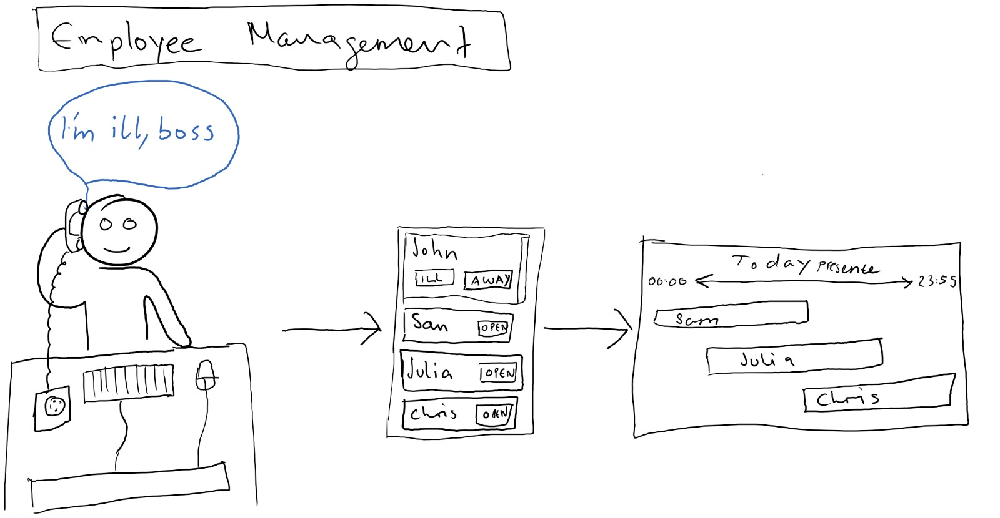
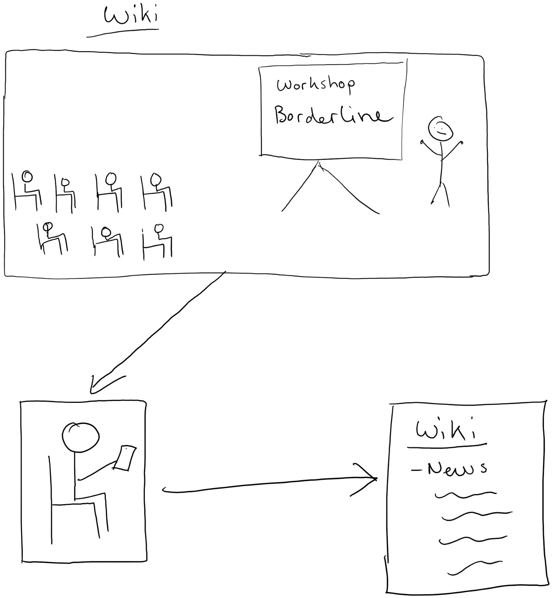
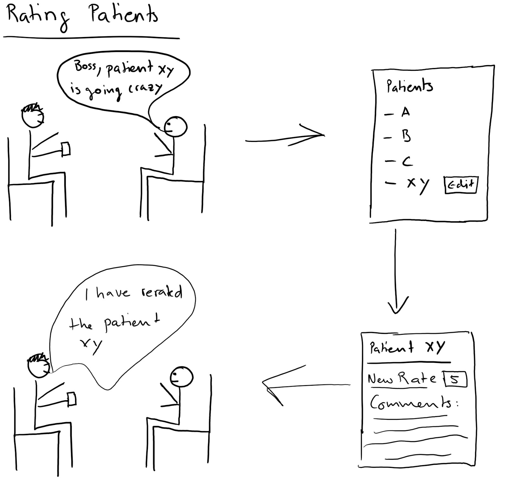
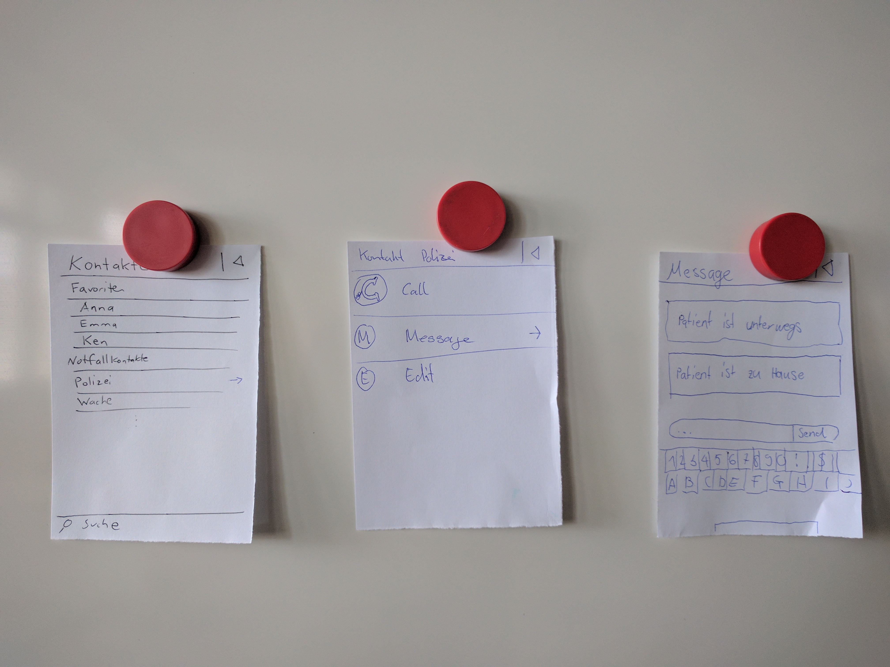
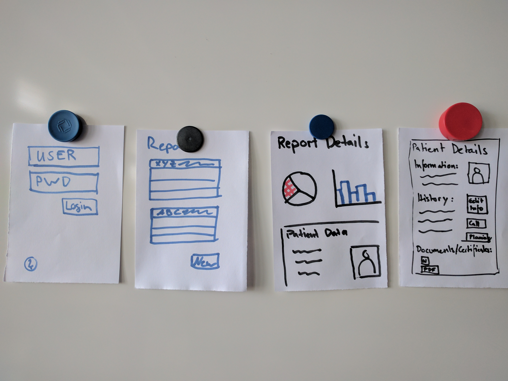
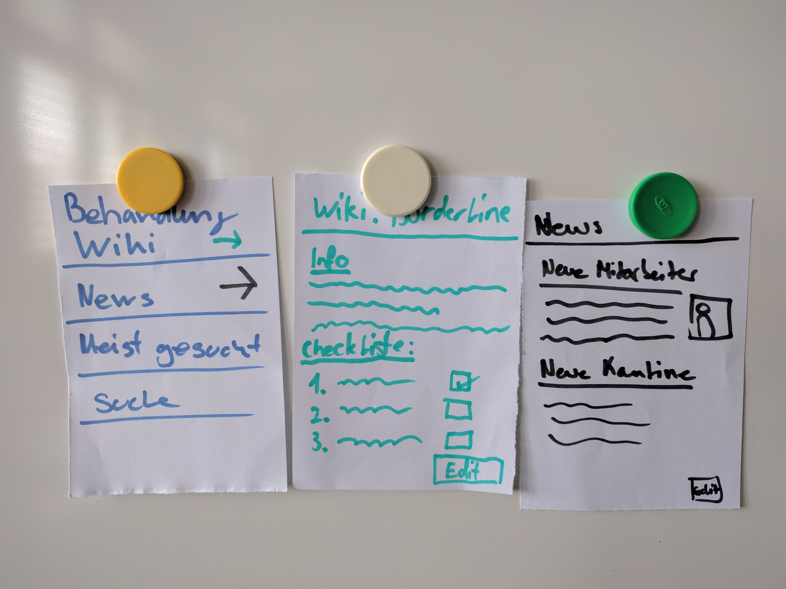

# CS1 Task 3: Final Requirements  
After talking with our interview partner we refined our requirements. The process which led to this document can be found (here)[CS1-Task3-process.md]. 

### Synthesizing
Our target user Theodor is teamleader at a mental institution / authority. He's 35 years old, has two children and lives in Steffisburg. Based on the requirements we found in the past iterations we asked him some questions in an interview. 

His main tasks are ordered by their workload: 
  * Scheduling his employees 
  * Being a contact person for his employees (functional and organizational questions) 
  * Defining Processes (functional and organizational) 
  * Coordinating with partners (hospitals etc.) 
  * Managing human resources 
  * Reporting 
  
What isn't part of his tasks: 
  * Interaction with patients in any way 

### Scoping 
What is in our scope: 
  * Application for management of employees and patients, especially for mental authorities. This application includes the follwing: 
    * Simple and fast adding and removing of patients
    * Rating patients based on their generated workload, as example 0 = almost no work 5 = full care 
    * Simple and fast adding, removing and managing of employees 
    * Scheduling of employees so that a daily minimum of employees are at work 
    * Simple interface to generated predefined reports (filterable and extendable) 
    * Central storage for communications with links to 
      * E-Mail 
      * SMS 
    * Management of personal contacts inside the application 
    * Public Wiki 

What isn't inside our scope: 
  * Detailed management of patients (e.g. patient dossier) 
  * Budgeting 
  * Human Resource process 
 
#### Storyboards 
In some storyboards we show how the application can be used everyday: 

### Prototypes 
To show how this application and its core features can look we made the following prototypes: 

