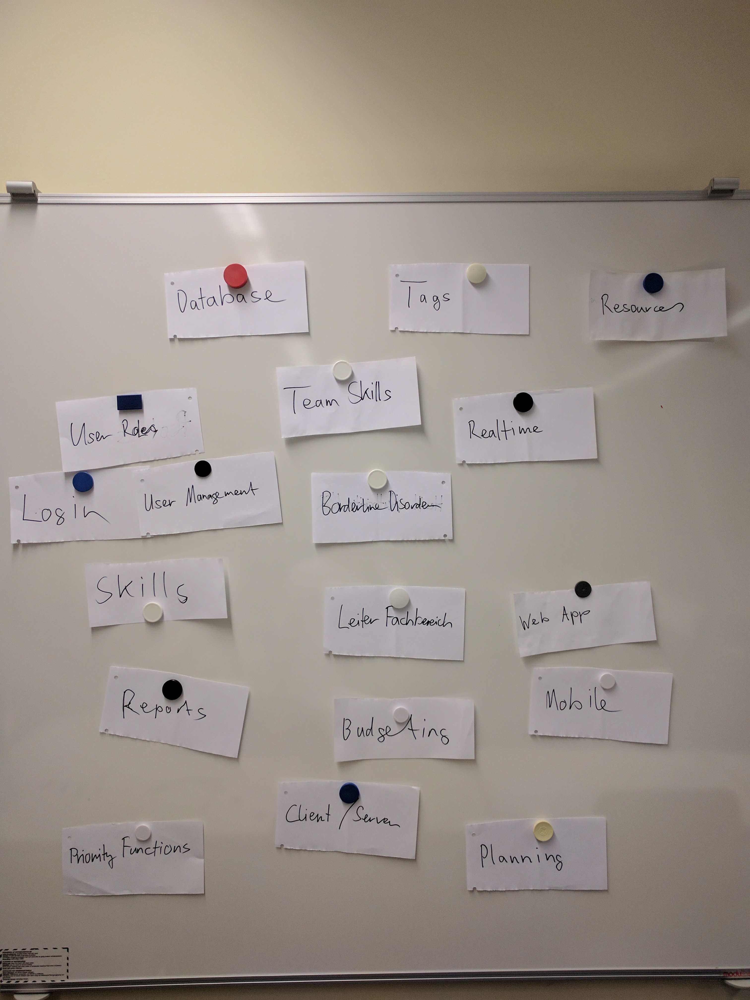
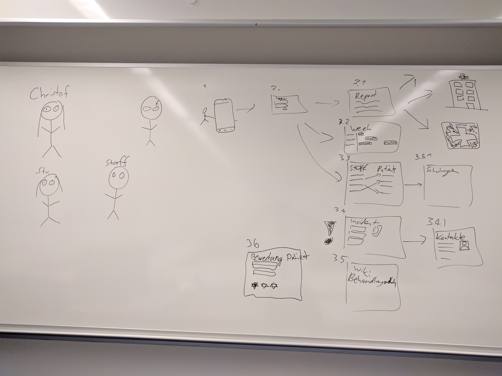
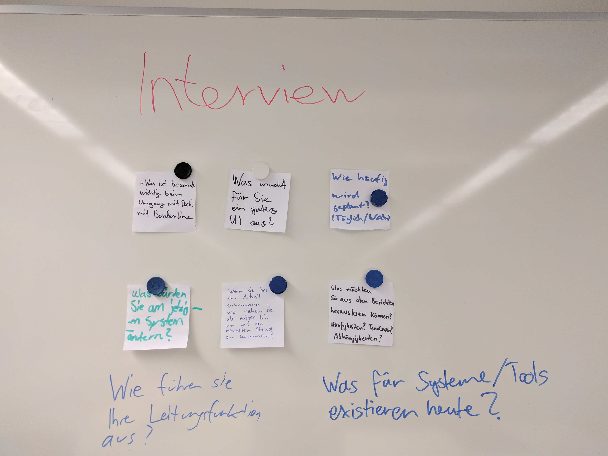

# CS1 Task 3: Exploring use cases and user requirements by the means of design thinking
### Scoping 
Result of a first brainstorm: 

After that, we grouped the cards into the different requriements: 

Notice: Our end user is the head of the psychiatry department. In short the colors: 

| Colour | Explanation                                                                          |
|--------|--------------------------------------------------------------------------------------|
| Green  | Project-team skills and resources                                                    |
| Red    | Domain requirements. These requirements must be met regardless of the end user       |
| Blue   | Technical requirements                                                               |
| Black  | User requirements, the user being the head of the psychiatry department in this case |

### Storyboards
Based on the results from "Scoping" we created a first general comic showing how the end result could be used by the end user: 

to

be

expanded

### Interview
To gather further input on the requirements, especially on the user requirements, we 
chose to do an interview with a head of a psychiatry department. To find good and 
insightful questions we each defined some questions based on the findings above: 

#### Interview Questions and Structure

1. Introduction 
	- BFH
	- 7 Team members
	- Software Engineering and Design
2. Main part (Questions)
	- Describe your main tasks
		- What task(s) use up most of your time and why? 
		- How do you get up to date? What are your first tasks on arrival? 
	- What are the current used tools and systems for your daily systems? 
		- Best one and why? 
		- Worst one and why? 
		- What is missing? 
	- What is very important in the handling of patients with "Borderline Disorder"? 
	- Are you involved in personal planning? If yes, how so? 
	- Who are the users for reports? 
	- [Show Drafts]: What do you think about these? 
3. Thank you & finish 

