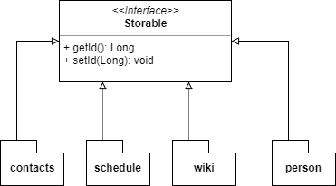

# Task 12: Class Diagram and Persitence

In the following class diagram are all classes which are involved for the persistence.

Package Diagram (Persisistence):

Class Diagram (Persisistence):

=> To make the Class Digram more clear, the arrows to the interface (Storable) were omitted
