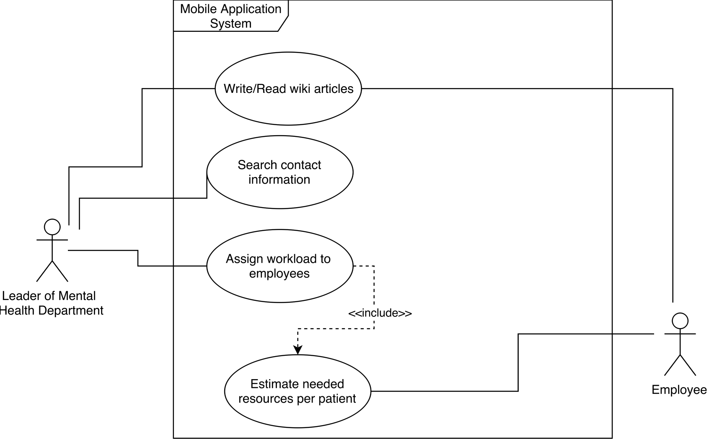
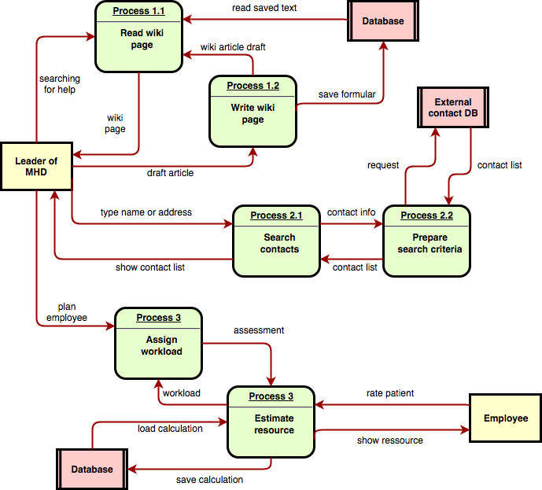

# Requirements Document ch.bfh.bti7081.s2017 Group Yellow
## Preface
This document describes the requirement spezifications of an application which supports the health authority management. The application is part of a patient management system (PMS) in mental authorities. The project is created as part of a group work at the BFH in module software engenieering.
This document is aimed to the health authority management as well as the development team. 
## 1.1 Version history
This document is saved in the versioning system GIT. Use git tools to browse history. It would be redundant to show the history here.
## 2 Introduction
The patient management system (PMS) is applied by an health authority organisation to manage and analyse the care of patients suffering from mental health problems. The PSM is devided in several applications, each covering a part of a target user.
One part is that of the health authority management which we describe here.
The application supports the management by doing five main tasks to reduce the workload and risks which may occur by working with high sensitive data.
The whole system is build in a enterprise network for easy accessibility.

1. Patient management 
The process to acquired or mutated the date of a patient is running via the health authority management. Whereby a patient's treatment data does not belong to it.
Staff management
2. A very central point is the administration and planning of the employees. Recruitment or dismissal are dealt by the health authority management. Also the weekly planning of the assignments and scheduling of the employees, also runs by the channel of the management. If an accidental event occurs such as illness, the management must change the mission plan or any dates.
3. Wiki
Parameters of experience, treatment methods, news, etc. are stored centrally in a database. An online encyclopedia is used as a knowledgebase, which is made accessible to the various user groups.
4. Contacts
Finally, then management must be able to access all contacts in the entire system. The access takes place for various reasons, on the one hand to provided for the patient and staff administration. On the other hand to contact the appropriate stations/organizations if an emergency oncures.

##3  Glossary
|Item|Comment|
|-|-|
|RSD|Requirement specification document|
|Wiki|Platform to exchange knowhow|
|PMS|Patient management system|
|Health authority|A health authority is a part of government which focuses on issues related to the general health of the citizenry |
|Knowledgebase|A central place where knowledge is kept|
|3G|Standard in mobile telecommunications|
|LTE|Newer and faster standard in mobile telecommunictions|
|HDPI|High resolution of a screen|

## 4 User requirements definition
This is an overview of the use cases:

## 5 System architecture
Our Application should be platform independent. This means that it should be possible to connect to the application from every device with any kind of operating system. Additionally, it should be accessible from the internet because of the employees outward of your enterprise. For this we designed a three tier web application.

### 5.1 Web frontend server
In this architecture we have the web frontend servers for the presentation layer (first tier). He we will use a webservice for the application presentation
### 5.2 Application server
Then we have the application servers who has the functionality and communication to the database. (second tier).
### 5.3 Database server
The third and last tier are the database servers with the whole information of our application.
### 5.4 Other components
Additionally, to our application components, we have also the following components:

- Two firewall to separate the internet from the DMZ and the DMZ from the internal network
- A F5 loadbalancer to handle the load and system failures
- All system are redundant
## 6 System requirements specification
### 6.1 Write/Read wiki articles  
| Name                          | Write/Read wiki articles                                                                                  |
|-------------------------------|-----------------------------------------------------------------------------------------------------------| 
| Number                        | 1                                                                                                         | 
| Actors                        | Leader of Mental Health Department (LMHD), Employee                                                       | 
| Short description             | The LMHD writes informative articles that can be read by employees.                                       | 
| Trigger                       | An employee asks LMHD a question that was already asked before.                                           | 
| Results                       | The answer to the question is in the wiki. The employee can read the article instead of asking the LMHD.  |              
                                                                                                                                             
#### Flow

|Nr.|Who|What|
|-|-|-|
|1.0|Employee|asks a question|
|1.1|LMHD|answers the question|
|1.2|LHMD|opens the web app|
|1.3|LHMD|navigates to the wiki feature|
|1.4|LHMD|creates a new entry, inputs the question|
|1.5|LHMD|inputs the answer and saves|
|1.6|Employee|does not know something|
|1.7|Employee|opens the web app|
|1.8|Employee|navigates to the wiki feature|
|1.9|Employee|inputs words into a search field|
|1.10|Employee|sees results|
|1.11|Employee|opens a result and reads the answer|

#### Exceptions / Variants
|Nr.|Who|What|
|-|-|-|
|1.10|Employee|does not find a result for his question|
|1.10.1|Employee|creates a new question|
|1.10.2|LHMD|sees unanswered questions when he opens the web app|
|1.10.3|LHMD|opens the unanswered questions|
|1.10.4|LHMD|writes an answer to the question and saves|
|1.10.5|Employee|sees that his question has been answered|
|1.10.6|Employee|selects the question and reads the answer|

### 6.2 Search contact information  
| Name                          | Search contact information                                                                                 |
|-------------------------------|-----------------------------------------------------------------------------------------------------------| 
| Number                        | 2                                                                                                         | 
| Actors                        | Leader of Mental Health Department (LMHD)                                                      | 
| Short description             | The LMHD searches for contact information in the web app when other parties have to be informed about the situation.                                    | 
| Trigger                       | An emergency situation ocurrs.                                           | 
| Results                       | The LMHD has fastly gained access to the most important contacts needed for further actions. |              
                                                                                                                                             
#### Flow

|Nr.|Who|What|
|-|-|-|
|2.0|LMHD|is informed about an emergency situation|
|2.1|LMHD|decides which persons have to be informed|
|2.2|LMHD|opens the web app|
|2.3|LMHD|navigates to the contact feature|
|2.4|LMHD|sees the most important contacts listed and calls them|
|2.5|LMHD|searches contacts by patient name or number|
|2.6|LMHD|sees contacts that are relevant for this patient|

#### Exceptions / Variants
|Nr.|Who|What|
|-|-|-|
|2.4|LMHD|does not see an important contact in the list|
|2.4.1|LMHD|searches for the contact|
|2.4.2|LMHD|adds the contact to the list|
|2.5|LMHD|searches a specific contact|
### 6.3 Assign workload to employees 
| Name                          | Assign workload to employees                                                                                 |
|-------------------------------|-----------------------------------------------------------------------------------------------------------| 
| Number                        | 3                                                                                                         | 
| Actors                        | Leader of Mental Health Department (LMHD)                                                      | 
| Short description             | The LMHD assigns workloads to employees depending on factors like experience, holidays and patient conditions etc.                                    | 
| Trigger                       | No workload is assigned to employees or the workload has to be reassigned because of incidents.                                          | 
| Results                       | The LMHD has an overview of all workloads of all employees. |              
                                                                                                                                             
#### Flow

|Nr.|Who|What|
|-|-|-|
|3.0|LMHD|begins the workload planning|
|3.1|LMHD|opens the web app|
|3.2|LMHD|navigates to the planning feature|
|3.3|LMHD|sees an overview of all patients and their conditions|
|3.4|LMHD|sees an overview of all available resources|
|3.5|LMHD|creates a new workload entry|
|3.6|LMHD|assigns the workload to an employee|
|3.7|LMHD|sees an updated overview which reflects the current assigned workload|

#### Exceptions / Variants
|Nr.|Who|What|
|-|-|-|
|3.4|LMHD|sees that there are too little or too much resources|
### 6.4 Estimate needed resources per patient
| Name                          | Estimate needed resources per patient                                                                                |
|-------------------------------|-----------------------------------------------------------------------------------------------------------| 
| Number                        | 4                                                                                                         | 
| Actors                        | Employee                                                      | 
| Short description             | The Employee knows the patient and can therefore estimate how much resources must be assigned to the patient.                                    | 
| Trigger                       | A new patient arrives or the condition of a patient changes.                                          | 
| Results                       | The patient condition is updated and available in the planning tool for the LMHD. |              
                                                                                                                                            
#### Flow

|Nr.|Who|What|
|-|-|-|
|4.0|Employee|takes in a new patient|
|4.0|Employee|opens web app|
|4.0|Employee|navigates to the estimation feature|
|4.0|Employee|creates a new patient profile|
|4.0|Employee|enters patient condition and saves|

#### Exceptions / Variants
|Nr.|Who|What|
|-|-|-|
|4.0|Employee|observes a change of the condition of a patient|
|4.0.1|Employee|opens app|
|4.0.2|Employee|navigates to the estimation feature|
|4.0.3|Employee|enters the name or number of the patient|
|4.0.4|Employee|selects the patient|
|4.0.5|Employee|changes the patient condition and saves|

## 7 System models

## 8 System evolution 
For a more momentary view about the System Requirements check the corresponding chapter "System Requirements". A short overview over the components and technology used for this application:

- Server
 * Web- and Databaseserver
 * (Backup server)
- Client
 * Mobile device
- Connectivity
 * Internet connection
 * Local network on customer site

### 8.1 Application relevant developments
**Mobile devices** are developed further all the time, especially in terms of processing power and resolution. In order to look good the application needs to scale correctly on high-DPI (hdpi) devices (devices with a very high resolution) since mobile devices with hdpi screens are becoming the norm. To stay future proof in this regard the application code should implement a way to scale correctly on various devices. 

### 8.2 Not application relevant developments
**Web-, Database-** and, if implemented **Backupservers**, are built to match the requirements of today. Unless there is a massive increase like 3 times the current users using the application and therefore generating load on the servers the requirements in this area stay the same. But even if that should occur todays servers are scalable and no changes in the server side code are necessary.

In terms of **Internet connectivity** even today most devices can connect to the internet over the mobile network (3G, LTE). The amount of mobile devices with internet access will only increase so there is no need for action.

## 9 Testing
Specific and detailed test cases will be done with the document Test Case Template after we have detailed UI specification.

**General**

- Check if login works
- Check if logout works
- Validate build and deployment

**Patient management and workload rating**

- Validate if all patients are visible
  * Check if patient data is visible
  * Check if patient data can be edited
- Validate if changes are saved correctly to db

**Employee management and scheduling**

- Validate if all employees are visible
  * Check if employee data is visible
  * Check if employee data can be edited
- Validate if changes are saved correctly to db
- Planing
  * Add new entry
  * Delete entry
  * Update entry

**Wiki**

- Modification
  * Add new entry
  * Delete entry
  * Update entry
- Check if changes are available for everyone
- Give employee access to wiki page and check access

**Contacts**

- Validate if all contacts are visible
- Check if message or call works

## 10 Appendices
Following requirements must be met

- Frontend should be responsive Web Design (Desktop, Tablet, Mobile)
	* Theodor is always underway, so it should by possible to access everywhere and with every device
- Internet connection
- The WEB-App should always be available
- Web Server 
- Database
	* Easy setup
	* It must not be big DB something like SQLite should be enough 
- Backup strategy
- Daily backup (in the evening)
- Domain Name
- DNS-Hoster 
 
